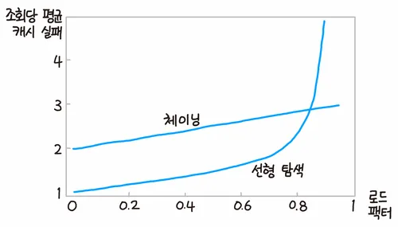

Hash
===

### 정의
임의의 길이를 갖는 임의의 데이터를 고정된 길이의 데이터로 매핑하는 단방향 함수를 해시 함수라 하는데 해당 함수를 적용해 나온 값을 해시값, 해시코드, 체크섬 등으로 부름

 

### 종류
* MD5 (Message-Digest algorithm 5)

    임이의 길이의 값을 입력받아 128비트의 길이의 해시값을 출력하는 알고리즘

* SHA
    
    암호학적 해시 함수

    * SHA-0, SHA-1

        160 비트의 해시 값을 사용
        
    * SHA-2 (SHA-224, SHA-256, SHA-384, SHA-512)

        8개의 32비트 상태를 갱신하는 압축함수 기반으로 해시 길이에 따라 224, 256, 384, 512 비트를 선택해서 사용

    * SHA-3 

        [Keccak 알고리즘](https://keccak.team/index.html) 을 사용
        * SHA3-224
        * SHA3-256
        * SHA3-384
        * SHA3-512
        * SHAKE128 (XOF (확장 가능한 출력 함수))
        * SHAKE256 (XOF (확장 가능한 출력 함수))

* CRC (Circular Redundancy Check)

    입력값에 대해 XOR 연산을 수행해 오류가 있으면 즉시 검출하는 알고리즘. 네트워크 전송과 같은 데이터 전송 과정에 사용되며 CRC를 연산하는 하드웨어 회로가 따로 탑재되어 있음 (x86, ARM 프로세서의 CRC32 명령어가 대표적)

 

### 해시의 목적
1. 역상 저항성

    출력된 값을 통해서 어떤 입력 값인지를 알아낼 수 없어야 함

1. 제 2 역상 저항성

    서로 다른 입력 값에 대해 출력된 값이 서로 충돌되지 않아야 함

1. 충돌 저항성

    같은 결과 값을 갖는 두 개의 입력 값 계산이 어려워야 함

 

### 해시 테이블
>파이썬 알고리즘 인터뷰

해시를 사용하는 자료구조로 정렬을 하지 않고도 검색과 삽입이 빠른 것이 장점이지만 반대로 정렬된 순서로 접근하게 된다면 더 많은 코스트가 발생하는 단점이 있음

|구분|개별 체이닝 (Separate Chaining)|오픈 어드레싱 (Open Addressing)|
|-|-|-|
|도표|||
|충돌 발생 시|연결 리스트로 연결하는 방식|빈 공간을 찾아 삽입하는 방식|

 

충돌을 해결한다 해도 수용량이 일정량 넘어서게 된다면 성능이 점점 떨어지게 됨

리스트 자체 크기를 키운 후 재배열을 할 수도 있으나 코스트가 큼 (점진적으로 옮기다가 다 옮기면 기존 테이블을 삭제하는 방식도 있으나 메모리 사용량이 더 커짐)

해시 비트 수를 늘리는 방법도 있음 (Consistent Hashing) 충돌이 많아지면 비트 수를 늘리고 저장공간도 늘리는 방식으로 이전함

 
