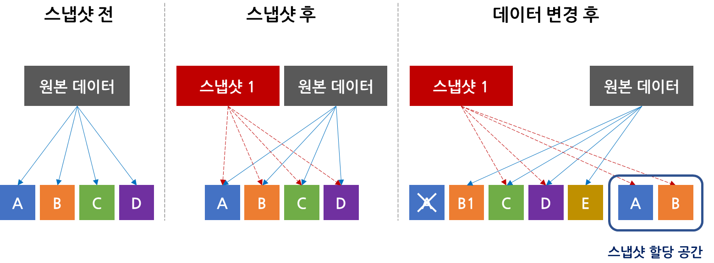
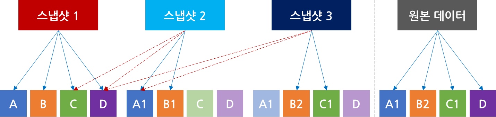

Snapshot
===

### 특징
스토리지에 저장된 데이터에 대해 특정 시점을 저장함으로서 해당 시점으로 되돌릴 수 있음. 데이터 복원, 보호 수단 중 하나이며 대용량 데이터의 운영 관리 비용을 최소화시킬 수 있음

데이터 보호 방식 중에서도 가장 빠르고 많이 쓰이는 기능이며 별도의 시스템이나 하드웨어 없이 보통 스토리지 공간 일부를 할애해 사용되기 때문에 저장과 복원을 더욱 빠르게 수행할 수 있는 장점이 있음. 하지만 저장 공간의 한계로 인해 스냅샷을 새로 생성할 때마다 오래된 스냅샷이 없어지기 때문에 단기적인 백업 및 복구 용도로 사용해야함

 

### 방식
1. Split-mirror 스냅샷 (Clone)

    Split-mirror 스냅샷은 가장 단순한 형태의 스냅샷이며 스냅샷 설정 시 원본 데이터를 통째로 복제하는 방식. 데이터가 통째로 복제되기 때문에 저장 방식과 구조가 단순하고 무엇보다 원본에 문제가 생겼을 경우 다시 통째로 복원할 수 있다는 장점이 있으나 원본 데이터와 같은 용량의 스토리지 공간이 필요하기 때문에 저장 효율이 좋지 않고 데이터양이 커질 수록 스냅샷 생성 속도나 가용량, 성능에 문제가 생김

1. Copy-on-write 스냅샷 (COW)
    
    >https://tech.gluesys.com/assets/cow_snap.png

    COW 스냅샷은 의미 그대로 쓰기 작업이 있다면 데이터를 복제해 처리하는 방식. 실질적인 데이터 처리는 데이터가 변경되는 시점에 이루어짐

    스냅샷을 생성 시에 바로 복제하지 않고 메타데이터만 만들어 놓음. 그 때 포인터로 연결하게 되는데 해당 포인터로 변경 내역에 대한 추적이 가능함

    즉각적으로 스냅샷 생성이 가능하고 변경되지 않은 데이터는 포인터로만 지정해놓기 때문에 Split-mirror 방식보다 데이터 이동이 적지만 데이터가 변경될 때마다 변경될 데이터를 한 번 읽고 스냅샷 공간에 한 번 쓰기 작업 후에 다시 쓰기 작업이 필요하게 되므로 CPU와 I/O 부하가 필연적으로 발생함

1. Redirect-on-write 스냅샷 (ROW)
    
    >https://tech.gluesys.com/assets/row_snap.png

     ROW 스냅샷은 COW 스냅샷에 비해 스토리지와 CPU의 오버헤드를 줄일 수있는 스냅샷 방식. COW 스냅샷과는 다르게 쓰기 작업이 있다면 새로운 공간에 쓰기 위치를 Redirect함. 이로 인해 변경되는 데이터에 대해 쓰기 작업이 한 번으로 줄어들게 됨 (COW는 읽기 1번, 쓰기 2번)

     다만 스냅샷을 삭제하는 경우라면 수정된 데이터의 포인터를 재설정하는데 추가적인 리소스 비용이 발생함. 또한 스냅샷을 여러 개 생성할수록 포인터가 복잡해짐

1. Incremental 스냅샷 (증분)
    
    >https://tech.gluesys.com/assets/incremental_snap.png

    증분 스냅샷은 초기 스냅샷 이후 변경되는 데이터만 새로운 스냅샷에 계속 기록하는 방식. 스냅샷을 생성할 때 변경되는 데이터만 기록하기 때문에 저장 공간 효율이 좋고 생성 속도, 성능이 좋음

1. Continuous Data Protection (CDP)
    CDP는 데이터 블록이 수정될 때마다 자동으로 스냅샷을 생성하는 방식. 일정 시간 단위로 스냅샷을 생성하는 Point-in-time 방식과는 다르게 수정했던 가장 최근 지점까지 롤백이 가능함. 하지만 변경이 있을 때마다 스냅샷을 생성하기 때문에 필요 이상의 부하가 발생할 수 있음

 

### 참고 문서
* [AWS의 스냅샷](../../aws/snapshot/README.md)

 
