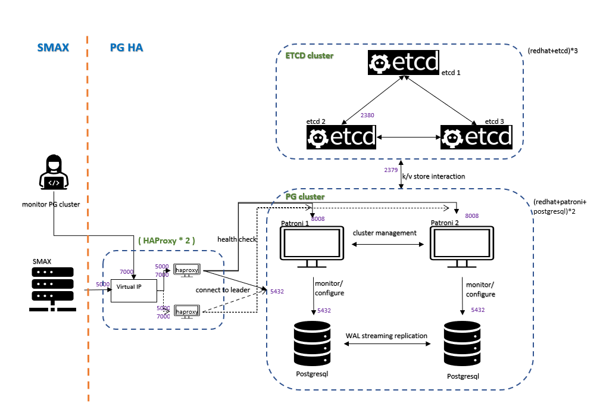

PostgresSQL HA 구성 (Cluster)
===

### 구성도

>https://docs.microfocus.com/doc/SMAX/24.4/HASQLPatroni

 

### 각 인스턴스 별 기능
|노드 이름|기능|
|-|-|
|`NODE-PG1`|PostgreSQL, Patroni|
|`NODE-PG2`|PostgreSQL, Patroni|
|`NODE-ETCD1`|ETCD|
|`NODE-ETCD2`|ETCD|
|`NODE-ETCD3`|ETCD|
|`NODE-HAPROXY1`|HAProxy|
|`NODE-HAPROXY2`|HAProxy|

 

__아래와 같이 구성할 수도 있음__
|노드 이름|기능|
|-|-|
|`NODE-PG1`|PostgreSQL, Patroni, ETCD|
|`NODE-PG2`|PostgreSQL, Patroni, ETCD|
|`NODE-PG3`|PostgreSQL, Patroni, ETCD|
|`NODE-HAPROXY1`|HAProxy|
|`NODE-HAPROXY2`|HAProxy|

 

### 방화벽 (기본값)
|포트 번호|설명|
|-|-|
|`5432`|PostgreSQL|
|`2379`, `2380`|ETCD|
|`8008`|Patroni|
|`5000`|HAProxy RW|
|`6000`|HAProxy RO|
|`7000`|HAProxy WEB DASHBOARD|

 

### 구성 순서 (노드 5개로 구성하는 예시)
  1. PostgreSQL 설치 (`NODE-PG1`, `NODE-PG2`, `NODE-PG3`)
      * 초기화는 하지 않음 (초기화는 Patroni 구성 시에 실행함)

  1. [ETCD](../../etcd/README.md#설치) 설치 (`NODE-PG1`, `NODE-PG2`, `NODE-PG3`)
      * ETCD 설치 후 정상 동작이 되어야만 Patroni 설치 가능

  1. [Patroni](./patroni/README.md) 설치 (`NODE-PG1`, `NODE-PG2`, `NODE-PG3`)
      * 아카이브 모드와 리커버리는 pgbackrest 구성 시에 활성화

  1. [pgbackrest](./pgbackrest/README.md) 설치 (`NODE-PG1`, `NODE-PG2`, `NODE-PG3`)
      * 설치 ➞ Partoni에서 아카이브 모드와 리커버리 파라미터를 활성화 ➞ STANZA 생성

  1. [HAProxy](../../haproxy/README.md) 설치 (`NODE-HAPROXY1`, `NODE-HAPROXY2`)
      * RW, RO, WEB DASHBOARD가 접속되는지 확인

 
